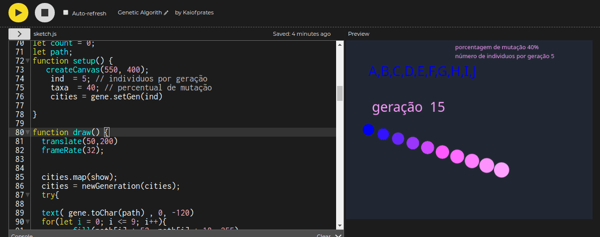

#### Inteligência Artificial

#### Algoritmos Genéticos

##### Proposta: produção de um algoritmo genético para a descoberta da melhor rota entre 10 cidades.

 Descrição do problema: o problema consiste em estabelecer uma rota que passe por 10 cidades diferentes (apenas uma vez em cada). As distâncias entre as cidades serão estabelecidas pelo programador. 
O objetivo do algoritmo será realizar os procedimentos genéticos associados (reprodução, mutação, seleção, etc) até que, após um número pré determinado de gerações se encontre um caminho que seja satisfatoriamente menor do que os da primeira geração.
Composição do algoritmo: O algoritmo deverá contar, no mínimo, com as seguintes funções: 
- Geração da população inicial: deverá conter mecanismos de verificação de genes repetidos e de indivíduos repetidos também.
O tamanho da população será determinado pelo usuário.
- Cálculo de aptidão: serão utilizados os valores da tabela mostrada anteriormente para se atribuir à cada rota o seu tamanho total.
- Seleção: deverá ser realizada através de torneio de tamanho definido pelo usuário ou, através de roleta.
- Reprodução: De acordo com a codificação associada ao problema a reprodução não poderá ser feita através do método “cruzamento de um ponto”.
- Mutação: Deverá ser realizada pelo método da substituição visto em aula e, também deverá ser aplicada à uma taxa escolhida pelo usuário (dentro da faixa de 0 a 5%)
Avaliação: este trabalho valerá 20 pontos e deverá ser feito individualmente. Dentre os itens que serão avaliados estão o pleno funcionamento do algoritmo e a observância aos itens contidos nesta proposta. Para que estes itens sejam de fato avaliados talvez sejam necessárias algumas perguntas no intuito de dirimir qualquer dúvida que possa surgir nesse processo avaliativo.

Observações: 
- Será enviado um modelo de algoritmo genético para servir de guia.
- Desde que siga os requisitos, qualquer linguagem de programação poderá ser utilizada.

# Algoritmo final 

